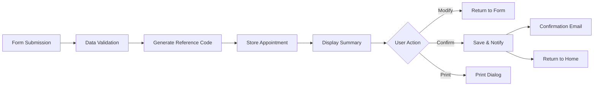

# Resumen Page (resumen.html)

The "Resumen" (Summary) page is the final step in the appointment booking flow, displaying all submitted information for user review and confirmation before finalizing the appointment.

## Purpose

This page serves to:
- Display a comprehensive summary of all entered information
- Provide a confirmation reference code
- Allow users to review and modify data before final submission
- Show required documentation for the appointment
- Offer options to print or save the appointment details

## Page Structure

### Header

Consistent header navigation maintained throughout the application.

### Title Section

```html
<div id="titulo">
    <h1>Resumen de su Cita</h1>
    <p>Revise los datos de su solicitud de cita previa. Asegúrese de que toda la información sea correcta antes
        de confirmar.</p>
</div>
```

## Summary Container

All appointment information is displayed within a structured container:

```html
<div class="contenedor-resumen">
```

### Appointment Status

```html
<div class="estado-cita">
    <div class="icono-estado">
        <svg xmlns="http://www.w3.org/2000/svg" width="48" height="48" viewBox="0 0 24 24" fill="none"
            stroke="currentColor" stroke-width="2" stroke-linecap="round" stroke-linejoin="round">
            <path stroke="none" d="M0 0h24v24H0z" fill="none" />
            <path d="M12 12m-9 0a9 9 0 1 0 18 0a9 9 0 1 0 -18 0" />
            <path d="M9 12l2 2l4 -4" />
        </svg>
    </div>
    <h2>Cita Pendiente de Confirmación</h2>
    <p class="codigo-cita">Código de referencia: <strong>REF-2025-10-001234</strong></p>
</div>
```

<Note>
**Reference Code**: `REF-2025-10-001234` - This unique code must be presented at the appointment.
</Note>

## Summary Sections

### 1. Tipo de Trámite (Procedure Type)

```html
<div class="seccion-resumen">
    <h3>
        <svg>...</svg>
        Tipo de Trámite
    </h3>
    <table class="tabla-resumen">
        <tr>
            <td>Trámite solicitado:</td>
            <td><strong>Expedición/Renovación DNI</strong></td>
        </tr>
    </table>
</div>
```

Displays the selected procedure type from the previous form.

### 2. Datos del DNI (DNI Data)

```html
<div class="seccion-resumen">
    <h3>
        <svg>...</svg>
        Datos del DNI
    </h3>
    <table class="tabla-resumen">
        <tr>
            <td>Número de DNI:</td>
            <td><strong>12345678X</strong></td>
        </tr>
        <tr>
            <td>Equipo de expedición:</td>
            <td><strong>ABC123</strong></td>
        </tr>
        <tr>
            <td>Fecha de validez:</td>
            <td><strong>15/03/2030</strong></td>
        </tr>
        <tr>
            <td>Número de soporte:</td>
            <td><strong>ABC123456789</strong></td>
        </tr>
    </table>
</div>
```

<Accordion title="DNI Information Summary">
  
All four DNI fields are displayed in a clean table format:
- **Número de DNI**: Identity document number
- **Equipo de expedición**: Issuance equipment code
- **Fecha de validez**: Current document expiration date (formatted as DD/MM/YYYY)
- **Número de soporte**: Support number from the DNI card

</Accordion>

### 3. Datos de la Cita (Appointment Details)

```html
<div class="seccion-resumen">
    <h3>
        <svg>...</svg>
        Datos de la Cita
    </h3>
    <table class="tabla-resumen">
        <tr>
            <td>Provincia:</td>
            <td><strong>Madrid</strong></td>
        </tr>
        <tr>
            <td>Oficina:</td>
            <td><strong>Madrid - Centro</strong></td>
        </tr>
        <tr>
            <td>Dirección:</td>
            <td><strong>C/ Gran Vía, 30, 28013 Madrid</strong></td>
        </tr>
        <tr>
            <td>Fecha:</td>
            <td><strong>Lunes, 15 de Octubre de 2025</strong></td>
        </tr>
        <tr>
            <td>Hora:</td>
            <td><strong>10:30</strong></td>
        </tr>
    </table>
</div>
```

<Accordion title="Appointment Location & Time">
  
**Enhanced Information**:
- Province and office selection carried over from form
- **Dirección added**: Full office address for user convenience
- **Formatted date**: Displayed as "Day of week, DD de Month de YYYY"
- **Time**: Selected appointment time slot

<Note>
The address field appears on the summary page but is not collected on the form - it's derived from the selected office.
</Note>

</Accordion>

### 4. Documentación Necesaria (Required Documentation)

```html
<div class="seccion-resumen">
    <h3>
        <svg>...</svg>
        Documentación Necesaria
    </h3>
    <table class="tabla-resumen">
        <tr>
            <td>DNI actual:</td>
            <td><strong>Obligatorio</strong></td>
        </tr>
        <tr>
            <td>Fotografía reciente:</td>
            <td><strong>Obligatorio (tamaño carnet)</strong></td>
        </tr>
        <tr>
            <td>Justificante de pago:</td>
            <td><strong>Se abona en la oficina</strong></td>
        </tr>
        <tr>
            <td>Código de confirmación:</td>
            <td><strong>REF-2025-10-001234</strong></td>
        </tr>
    </table>
</div>
```

<Accordion title="Document Checklist">
  
**What to Bring**:

1. **DNI actual** (Current DNI)
   - Status: Obligatorio (Mandatory)
   - The document being renewed

2. **Fotografía reciente** (Recent photograph)
   - Status: Obligatorio (Mandatory)  
   - Format: Passport size (tamaño carnet)
   - Must be recent

3. **Justificante de pago** (Payment receipt)
   - Note: Se abona en la oficina (Paid at the office)
   - Payment is made on-site, not in advance

4. **Código de confirmación** (Confirmation code)
   - The reference code: REF-2025-10-001234
   - Must be presented to access the appointment

</Accordion>

## Action Buttons

```html
<div class="botones-accion">
    <a href="./seleccionar-cita.html" id="btn-modificar">
        <svg>...</svg>
        Modificar Datos
    </a>
    <a href="./index.html" id="btn-confirmar">
        <svg>...</svg>
        Confirmar Cita
    </a>
    <a href="./index.html" id="btn-imprimir">
        <svg>...</svg>
        Imprimir Resumen
    </a>
</div>
```

<Accordion title="Available Actions">
  
### Modificar Datos (Modify Data)
- **Icon**: Edit/pencil icon
- **Action**: Returns to form page (`seleccionar-cita.html`)
- **Purpose**: Allow corrections before final confirmation
- **Style**: Secondary button style

### Confirmar Cita (Confirm Appointment)
- **Icon**: Checkmark in circle
- **Action**: Finalizes appointment and returns to home
- **Purpose**: Complete the booking process
- **Style**: Primary button style (likely green/prominent)

### Imprimir Resumen (Print Summary)
- **Icon**: Printer icon
- **Action**: Triggers print dialog
- **Purpose**: Provide physical copy of appointment details
- **Style**: Secondary button style

<Note>
In production, "Imprimir Resumen" should trigger `window.print()` via JavaScript rather than navigating to index.html.
</Note>

</Accordion>

## Information Section

```html
<div class="info">
    <h3>
        <svg>...</svg>
        Información Importante
    </h3>
    <div>
        <p><strong>Importante:</strong> Debe presentarse en la oficina <strong>15 minutos antes</strong> de la
            hora de su cita con toda la documentación necesaria.</p>
        <p>Si no puede acudir a su cita, le rogamos que la anule con al menos <strong>24 horas de
                antelación</strong> para que otra persona pueda aprovecharla.</p>
        <p>El <strong>código de confirmación</strong> es imprescindible para acceder a la oficina. Guárdelo o
            imprima este resumen.</p>
        <p>Recuerde que las <strong>tasas se abonan en la oficina</strong> preferentemente con tarjeta de
            débito/crédito.</p>
    </div>
</div>
```

<Note>
**Critical Information**:
- Arrive **15 minutes early** with all documentation
- Cancel with **24 hours notice** if unable to attend
- Confirmation code is **essential** for office access
- Fees paid **at the office** preferably by card
</Note>

## User Flow

<Steps>

<Step title="Arrive at summary page">
  User is directed here after submitting the appointment form
</Step>

<Step title="Review appointment status">
  User sees "Cita Pendiente de Confirmación" (Appointment Pending Confirmation) and receives reference code
</Step>

<Step title="Verify all information">
  User reviews:
  - Procedure type
  - DNI information
  - Appointment location and time
  - Required documentation
</Step>

<Step title="Check critical reminders">
  User reads important information about:
  - Arrival time
  - Cancellation policy
  - Required confirmation code
  - Payment method
</Step>

<Step title="Choose action">
  User decides to:
  - Modify data (return to form)
  - Confirm appointment (finalize)
  - Print summary (for records)
</Step>

</Steps>

## Visual Design

### Layout

- **Card-based sections**: Each information category in distinct visual container
- **Table format**: Clean two-column tables for data display
- **Icon headers**: Each section has an identifying SVG icon
- **Prominent status**: Large checkmark icon for appointment status
- **Button row**: Three action buttons at bottom

### Typography

- Labels in regular weight
- Values in **bold** for emphasis
- Reference code highlighted with strong styling
- Clear hierarchy with h1, h2, h3 headings

### Styling

CSS files:
- `style.css` - Base styles
- `headerfooter.css` - Header and footer
- `resumen.css` - Summary page-specific styles

## Technical Implementation

### Data Display

The page displays static sample data. In production:

```javascript
// Data should be retrieved from:
// 1. URL parameters (if using GET)
// 2. Session storage
// 3. Server response
// 4. Database query

// Example with URL parameters:
const params = new URLSearchParams(window.location.search);
const dni = params.get('numero-dni');
const fecha = params.get('fecha-cita');
// etc.
```

### Reference Code Generation

The reference code `REF-2025-10-001234` should be:
- Uniquely generated server-side
- Stored in database with appointment details
- Used for appointment lookup and verification

### Print Functionality

```javascript
// Print button should trigger:
document.getElementById('btn-imprimir').addEventListener('click', (e) => {
    e.preventDefault();
    window.print();
});
```

<Note>
Consider adding print-specific CSS with `@media print` to optimize the printed output.
</Note>

## Accessibility Features

- Semantic table structure for data presentation
- Clear visual status indicator (checkmark icon)
- High contrast for critical information
- Descriptive button labels with icons
- Logical reading order
- Keyboard navigation support

## Data Flow



## Security Considerations

<Note>
**Production Requirements**:

- Verify user session/authentication
- Validate reference code uniqueness
- Prevent unauthorized access to summaries
- Implement CSRF protection
- Sanitize all displayed data
- Use HTTPS for all communications
- Rate limit confirmation requests
- Log all appointment confirmations
</Note>

## Enhancement Opportunities

### Current Implementation
- Static sample data display
- Manual print triggering
- Basic confirmation flow

### Potential Improvements

1. **Dynamic Data Population**: Pull actual form submission data
2. **QR Code**: Generate QR code with reference number
3. **Email Summary**: Send confirmation email with details
4. **SMS Notifications**: Option to receive appointment reminders
5. **Calendar Export**: Generate .ics file for calendar apps
6. **PDF Generation**: Create downloadable PDF of summary
7. **Appointment Modification**: Allow date/time changes without re-entering all data
8. **Cancellation**: Direct cancellation link from summary page

## Related Pages

- [Seleccionar Cita](/pages/seleccionar-cita) - Previous page (form)
- [Home](/pages/home) - Return destination after confirmation
- [Iniciar Solicitud](/pages/iniciar-solicitud) - Start of booking flow
